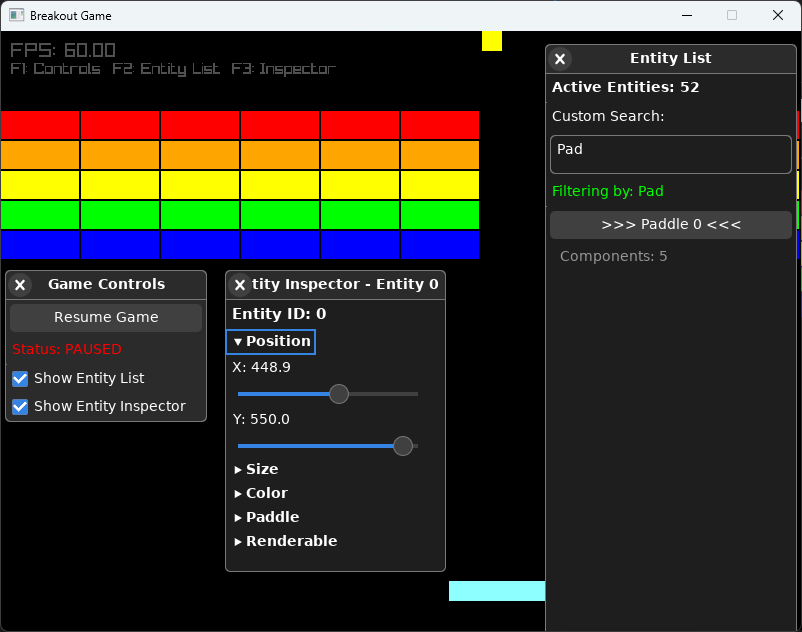

# Breakout Game with ECS Architecture

A Breakout game implementation using Zig and Raylib with Entity-Component-System (ECS) architecture.

🙏 Now with debugging UI implemented using DVUI ([https://github.com/david-vanderson/dvui](https://github.com/david-vanderson/dvui))

## Controls

- **Left Arrow / Right Arrow:** Move the paddle left/right
- **Escape:** Quit the game (works during gameplay and after Game Over)

## Demo

[https://vimeo.com/1108027420?share=copy](https://vimeo.com/1108027420?share=copy)

